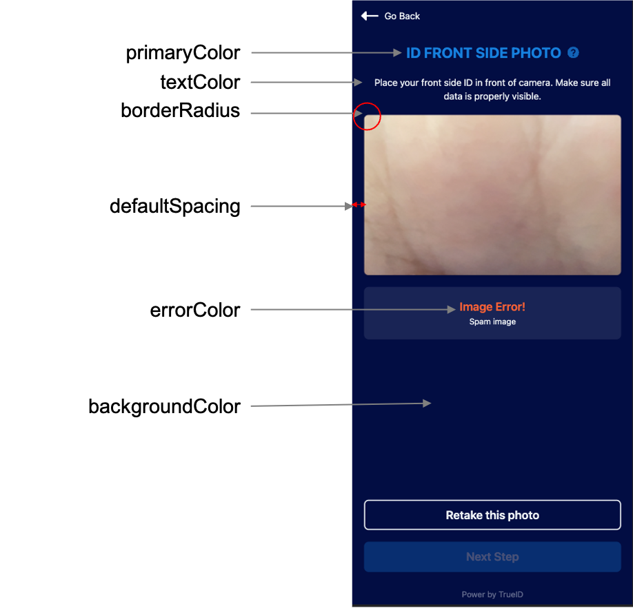

# trueID eKYC React Native SDK 

## 1.Requirements
### IOS
  * Minimum iOS Deployment Target: 11.0
  * Xcode 13 or newer
  * Swift 5
### Android
* minSdkVersion: 21
* targetSdkVersion: 32
* compileSdkVersion 32

## 2.Installation 
- copy react-native-true-id to your project
- in file package.json, add "react-native-true-id": "file:./react-native-true-id", to dependency
```yaml
dependencies:
  ...
   react-native-true-id:
    path: react-native-true-id
```
### 2.1 IOS setup
On iOS add the following to your Info.plist
```xml
<!-- Camera Access -->
<key>NSCameraUsageDescription</key>
	<string>eKYC will use your camera to take indentity card and selfie.</string>

```
### 2.2 Android setup
No extra setup is needed.

## 3.Usage
### Set configure
```javascript
    
    var configUI  = "{\"primaryColor\":\"#C60C0C\",\"secondaryColor\":\"#C60C0C\",\"textButtonColor\":\"#FFFFFF\",\"errorColor\":\"#C60C0C\",\"textColor\":\"#A2ADBF\",\"borderInputColor\":\"#D3D9E0\",\"backgroundColor\":\"#ffffff\",\"closeColor\":\"#C60C0C\",\"borderRadius\":8,\"defaultSpacing\":20,\"livenessType\":\"trueid\",\"allowEditOcr\": true,\"hasInstroctions\": false}"

    var configInfo = {
                domain: "",
                domainPath: "/ekyc/v1.2",
                authDomain: "",
                authDomainPath: "/v1/oauth",
                appId: "",
                appSecret: "",
                zoomLicenseKey: "",
                zoomPublicKey: "",
                zoomServerBaseURL: "",
                zoomAuthURL:  "",
                accessToken: "",
                configUI: configUI,
              }
    

  RNTrueID.configure(configInfo)
```
* ConfigUI json notes : 
- livenessType : (trueid|facetec)
- allowEditOcr : bool
- color config : 
  

### Set Language 
TrueID support languages : vi, en
```javascript
  RNTrueID.setLanguage({language: "vi"})
```
Custom Language IOS
copy vi.strings and en.strings to root project ios
  
Custom Language Android


### Start EKYC
```javascript
  
   RNTrueID.start((result) => {
                console.log("result", result)
                if(result.code == 0) {
                  // user close sdk 
                } else if(result.code == 1){
                  // success
                } else {
                  // handle error 
                  console.log("errorMesssage : ", result.errorMesssage)
                }
              })
  
```

### Result Object 
```javascript
class VerificationResult {
  Number code; 
  String errorMesssage;
  String clientId;
  String requestId;
  Decision decision;
  FaceMatching faceMatching;
  PersonInfo idInfo;
  bool livenessCheck;
  RawImage rawImage;
  Map ekycResult;
}

class PersonInfo {
  String idNumber;
  String gender;
  String dob;
  String fullname;
  String address;
  String doi;
  String givenPlace;
  String origin;
  String dueDate;
  Number idType; 
  String qrcode;

//   0: 'OTHER',
//   1: 'CMND',
//   2: 'PASSPORT',
//   3: 'CCCD',
//   4: 'CMND_SIQUAN',
//   5: 'EID',
//   6: 'GPLX'


  DetailAddress idOriginProvince;
  DetailAddress idOriginDistrict;
  DetailAddress idOriginWard;
  DetailAddress idAddressProvince;
  DetailAddress idAddressDistrict;
  DetailAddress idAddressWard;
 }

class DetailAddress {
 Number code;
 String value;
}
class Decision {
 Number code;
 String decision;
}

class RawImage {
  String front; // base64
  String back; // base64
  String selfie; // base64
}

class FaceMatching {
  bool matched;
  Number similarity;
  Number confidenceLevel;
}
```
